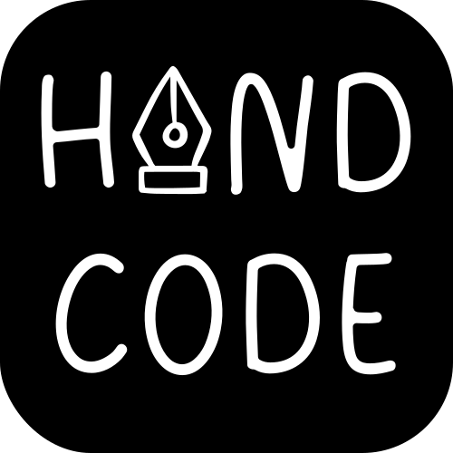
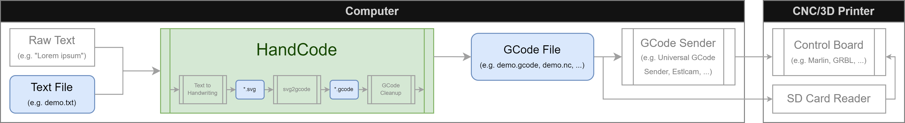
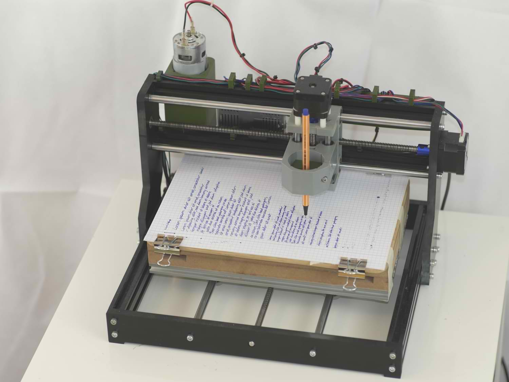
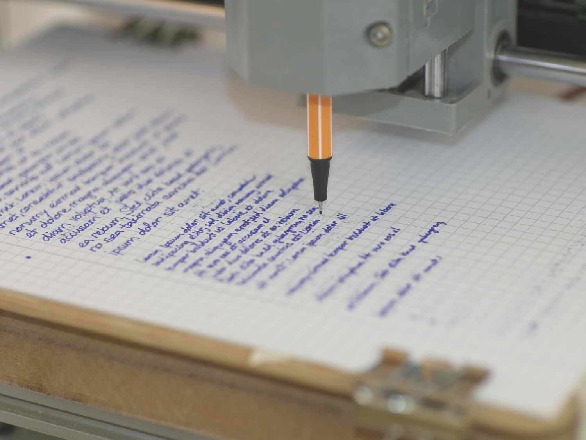

# HandCode - A handwiriting gcode generator

## Overview

HandCode is a simple tool that enables its users to automatically create GCode from plain text input. This GCode can then be used to, for example, build a handwriting robot. It is based on a pretrained AI model to create the handwriting path. This leads to unique characters, a natural flow between characters and a realistic writing order.

## How to Use

### Getting started

#### Preparations

First of all, you need to have an 3-axis gantry controlled by GCode. Common examples for this are CNCs, 3D printers, laser cutters or engravers. You should have some experience in using your machine and you should know what GCode is.
You also have to either clone the repo or download a release of this program.
Lastly, it is recommended that you build a toolholder that can firmly hold your pen. I designed a parametrized and customizable pen holder that originally was designed to be used in a standard 3018 CNC mill, but can be adapted to many different sizes. The files for this penholder can be found [here](doc/files).

TODO add images of penholder and cnc and both

#### Using HandCode

Open HandCode and wait until the neural network finished loading, this may take a few minutes. While waiting, you can take the text you want to convert to handwriting and save it in a plain text file. After the program finished loading you can open your text file by clicking the `...` button. If you want, you can change the settings (see below for all options) or edit your input if you noticed a mistake. After editing, changes will be saved to the file. Probably the most interesting options are the font options, which can be tested in this [web demo](https://caligrapher.ai). Note, that the font size setting is not accurate and does not represent any real life metric. See "Calibrating" below for more information.

After changing the settings to your liking you can click `Start` to start the conversion process. During this process, command prompts may open. These are for converting the handwriting to gcode and should not concern you. Please do not close them manually, they should close themselves.

When the program finishes converting, which may take a few minutes, you can use its generated GCode which is located in the `data` subdirectory.

#### Working with the generated GCode

The generated GCode can be saved on an SD-Card or loaded into a GCode Sender program such as [Estlcam](https://www.estlcam.de/). Before running the GCode you should zero your tool/pen to the top left of where you want your text to start. Also, make sure that the lines on the paper are parallel to your X Axis. After starting the program you should stay close to the machine to ensure it does not break or move out of bounds.

#### Calibrating and Testing different values

I recommend spending some time to calibrate the font size to different line heights for your environment. To do so, simply take a text file with 10 lines of content and convert it to GCode with different font sizes. You can then measure the actual distance and graph and inter-/extrapolate it to whatever font size you might need in the future.
Furthermore i encourage you to play around with the other options, such as how high you have to lift the pen and how low you have to put it to write but not drag unneccessarily.
All options available are described below.

### Options

#### File Options

##### Filename:

This is the name (and path) of the text file, whose content will be used for the synthesis. If it is located within the data subdirectory it will simply show the filename, otherwise the whole path will be displayed. You can select your own text files or write in the large text input below to change the data that will be converted to gcode. If you just want to write a short text in the large text input field, the filename input can be used for naming your output file. The inputted text will then be stored in a file located in the data subdirectory.
> :warning: **Warning**: If you are editing after opening a text file, starting the conversion process will apply your changes to the open file. This may lead to unexpected data loss. Please verify that you are editing the correct file before each conversion. Closing the program will discard all changes that are not yet saved.

##### Export extension:

This is the extension that will be used for the export file, the (base-)filename will be inherited from the filename field. The export content will always be GCode, but some programs (i.e. Estlcam) require the file extension to be .nc, so this field can be used to avoid the renaming step after each conversion.

_Examples:_

| Filename    | Export ext. | Exported file |
|-------------|-------------|---------------|
| demo.txt    | gcode       | demo.gcode    |
| estlcam.txt | nc 	    | estlcam.nc    |
| de.mo.txt   | gcode       | de.mo.gcode   |
| otherext    | ext         | otherext.ext  |

#### Font Options

##### Size:

This is the "font" size of the generated text. In theory it should be the line height in mm, so if you have paper with lines spaced 15mm apart from each other, the font size should be 15mm. However in practice, it has been more reliable to simply trial and error this value. To the best of my knowledge and testing, this scales linearly, so if you've tested and found out that for 15mm paper, the corrext font size is 30, then the font size for 30mm _should be_ 60mm.

##### Style:

This is the handwriting sample used. The project is based on a neural network for handwriting synthesis for which 12 people have submitted samples of their handwriting. You can choose between those 12 or create your own handwriting sample.
You can test out all 12 handwriting samples in a [web demo](https://www.calligrapher.ai/).

##### Legibility:

Honestly, i don't really know what exactly this does, i just copied its description from the [web demo](https://www.calligrapher.ai/). It should be a value between 0 and 1.

#### Pen Options

##### Z Up (Travel)

This is the (absolute) Z-Position (in mm) of your CNC tool head when the pen is travelling, i.e. not writing. This should not be too small, otherwise you may be drawing lines between characters.

##### Z Down (Writing)

This is the (absolute) Z-Position (in mm) of your CNC tool head when the pen should be drawing. This value should be 0 if you've levelled your CNC correctly and using a pen that does not need any pressure (e.g. fineliners). If you are using a pen that needs pressure (e.g. ball bens) you can decrease this value. For me a value of 0 is perfect for fineliners and a value of -1.5 applies enough pressure for a ball pen.

> :warning: **Warning**: If you are testing what the correct Z Down value is, i recommended to use a pen that is reasonably flexible to avoid damaging your CNC.

#### Other Options

##### Swap X/Y Axis (Rotate 90°)

This checkbox should be set if you want to mount the paper perpendicular to your CNC/3D Printer. Usually the GCode generated will write each line along the X-Axis and lines below each other along the Y-Axis. By checking this box, the GCode will move the tool head along its Y Axis while writing each line and along the X axis when going to the next line.

## Features

This project is based on great work from Sean Vasquez, who published his work on handwriting synthesis (see contributions). It ensures the uniqueness of each letter and the natural flow from each letter to the next. You can choose between 12 sampled handwritings or (if you _really_ want to, i dont know how though) sample your own handwriting to use with this program.

## Building

For building this project you need to do the following:

### Windows

You should be simply able to run the `build.bat` script provided in the `build` subdirectory. Besides the libraries you installed for the project you need to install [cx_Freeze](https://cx-freeze.readthedocs.io/en/stable/). You can install cx_Freeze using

    pip install cx_Freeze

The provided script will do the following:
1. Build and bundle the software to the best of cx_Freeze's capabilities, see [cx_Freezes documentation](https://cx-freeze.readthedocs.io/en/stable/) and my `build/setup.py` script for more information
2. Add files (and folders) cx_Freeze did not copy correctly (mainly files from tensorflow since cx_Freeze somehow misses a few and i dont know how to force cx_Freeze to include the whole tensorflow library)
3. Remove unneccessary files, especially library data, demos, tests, duplicate files and folders, especially pycache folders. This step is not strictly needed but it reduces the package size from initially ~400-500MB to 300MB (still very big but meh)

### Other

I have not tested nor built this project on other platforms then mentioned. If you wish to build this for other platforms, you have to include the [svg2gcode binary](https://github.com/sameer/svg2gcode/releases/) for your platform in the `src/lib/svg2gcode` subdirectory and change the `os.system(...)` call in `converttogcode(...)` within `src/convert.py`

## Contributions

This project is written in [Python](https://python.org) and uses the following projects:
 - [svg2gcode](https://github.com/sameer/svg2gcode)
 - [handwriting-synthesis](https://github.com/sjvasquez/handwriting-synthesis)