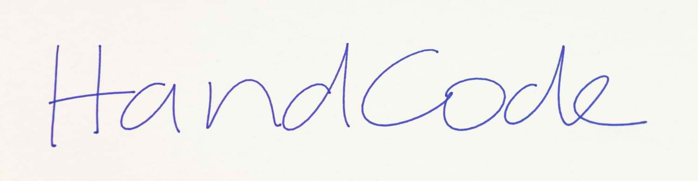
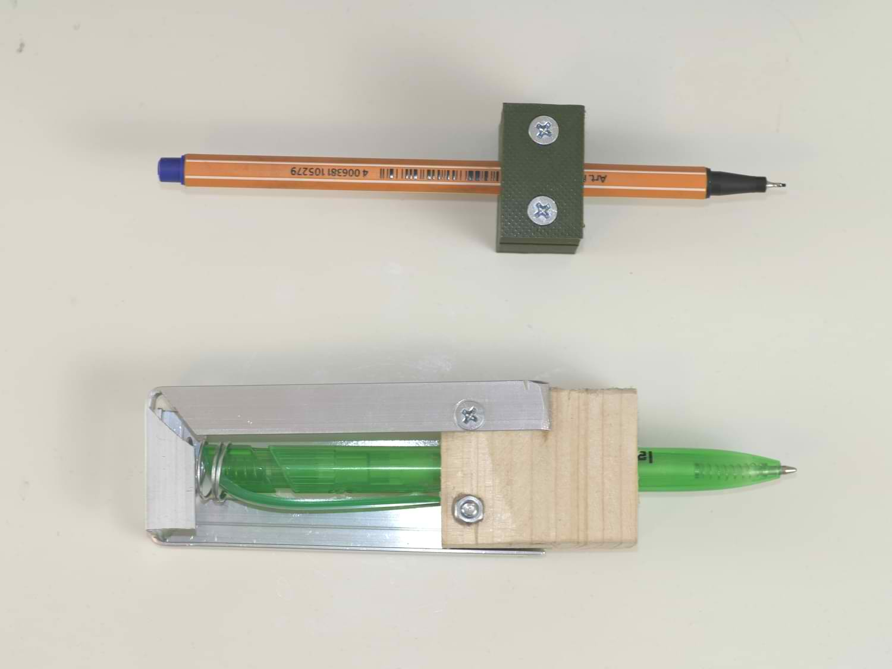
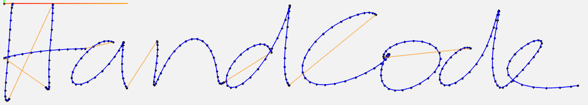
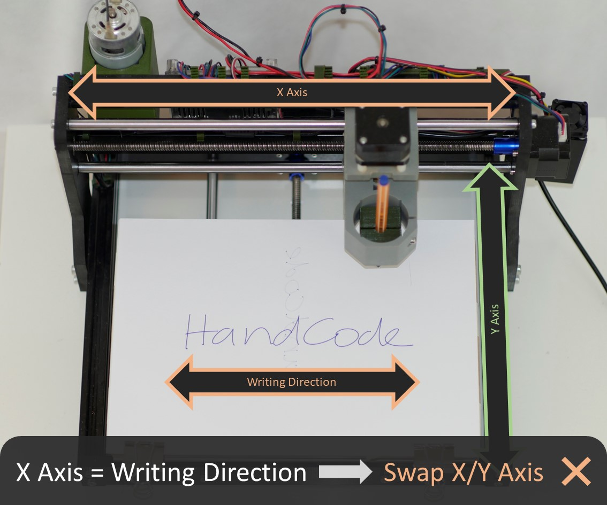
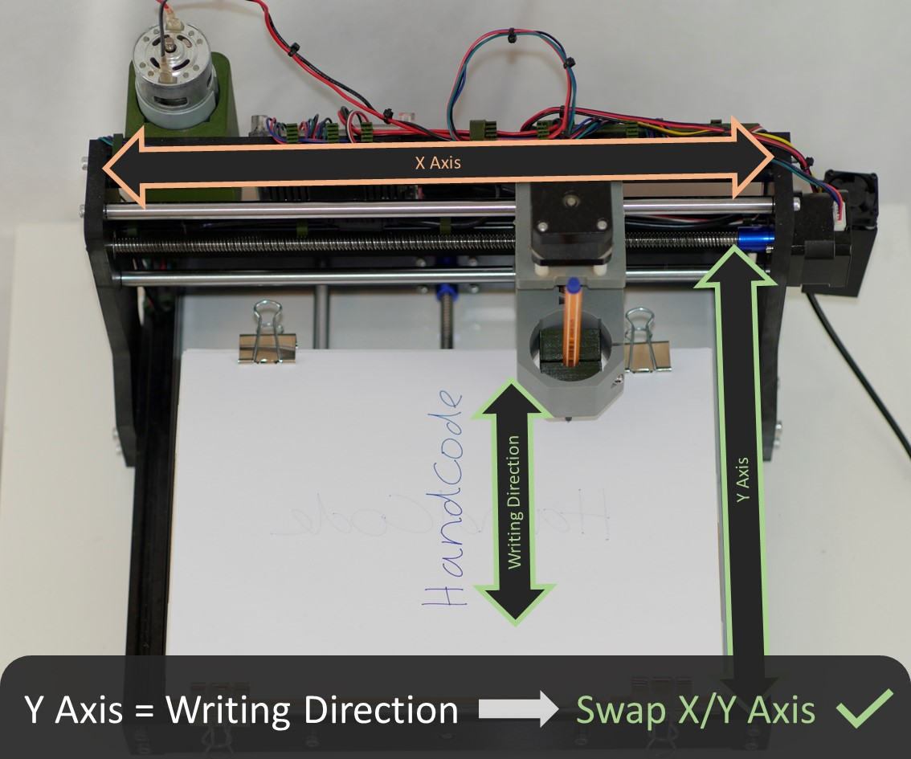

# HandCode - A handwiriting GCode generator

## Overview

HandCode is a simple tool that enables its users to automatically create GCode from plain text input. This GCode can then be used to, for example, build a handwriting robot. It is based on a pretrained AI model to create the handwriting path. This leads to unique characters, a natural flow between characters and a realistic writing order.

## How to Use

> [!WARNING]
> Please read and understand the license carefully before using this program! 

### Getting started

#### Preparations

First of all, you need to have an 3-axis gantry controlled by GCode. Common examples for this are CNCs, 3D printers, laser cutters or engravers. You should have some experience in using your machine and you should know what GCode is.
You also have to either clone the repo or download a release of this program (duh).
Lastly, it is recommended that you build a toolholder that can firmly hold your pen. I designed a parametrized and customizable pen holder that originally was designed to be used in a standard 3018 CNC mill, but can be adapted to many different sizes. The files for this penholder can be found [here](doc/files).

#### Using HandCode

Install HandCode by downloading the latest release or by following the guide below. Open HandCode and wait until the neural network finished loading, this may take a few minutes. While waiting, you can take the text you want to convert to handwriting and save it in a plain text file. After the program finished loading you can open your text file by clicking the `...` button. If you want, you can change the settings (see below for all options) or edit your input if you noticed a mistake. After editing, changes will be saved to the file. Probably the most interesting options are the font options, which can be tested in this [web demo](https://caligrapher.ai). Note, that the font size setting is not accurate and does not represent any real life metric. See "Calibrating" below for more information.

After changing the settings to your liking you can click `Start` to start the conversion process. During this process, command prompts may open. These are for converting the handwriting to gcode and should not concern you. Please do not close them manually, they should close themselves.

When the program finishes converting, which may take a few minutes, you can use its generated GCode which is located in the `data` subdirectory.

#### Working with the generated GCode

The generated GCode can be saved on an SD-Card or loaded into a GCode Sender program such as [Estlcam](https://www.estlcam.de/). Before running the GCode you should zero your tool/pen to the top left of where you want your text to start. The starting point should not be at the very limits of your machine as it may move slightly beyond the zero position. Also, make sure that the lines on the paper are parallel to your X Axis. After starting the program you should stay close to the machine to ensure it does not break or move out of bounds.

 &nbsp;

#### Calibrating and Testing different values

I recommend spending some time to calibrate the font size to different line heights for your environment. To do so, simply take a text file with 10 lines of content and convert it to GCode with different font sizes. You can then measure the actual distance and graph and inter-/extrapolate it to whatever font size you might need in the future.
Furthermore i encourage you to play around with the other options, such as how high you have to lift the pen and how low you have to put it to write but not drag unneccessarily.
All options available are described below.

### Options

#### File Options

##### Filename:

This is the name (and path) of the text file, whose content will be used for the synthesis. If it is located within the data subdirectory it will simply show the filename, otherwise the whole path will be displayed. You can select your own text files or write in the large text input below to change the data that will be converted to gcode. If you just want to write a short text in the large text input field, the filename input can be used for naming your output file. The inputted text will then be stored in a file located in the data subdirectory.
> :warning: **Warning**: If you are editing after opening a text file, starting the conversion process will apply your changes to the open file. This may lead to unexpected data loss. Please verify that you are editing the correct file before each conversion. Closing the program will discard all changes that are not yet saved.

##### Export extension:

This is the extension that will be used for the export file, the (base-)filename will be inherited from the filename field. The export content will always be GCode, but some programs (i.e. Estlcam) require the file extension to be .nc, so this field can be used to avoid the renaming step after each conversion.

_Examples:_

| Filename    | Export ext. | Exported file |
|-------------|-------------|---------------|
| demo.txt    | gcode       | demo.gcode    |
| estlcam.txt | nc          | estlcam.nc    |
| de.mo.txt   | gcode       | de.mo.gcode   |
| otherext    | ext         | otherext.ext  |

#### Font Options

##### Size:

This is the "font" size of the generated text. In theory it should be the line height in mm, so if you have paper with lines spaced 15mm apart from each other, the font size should be 15mm. However in practice, it has been more reliable to simply trial and error this value. To the best of my knowledge and testing, this scales linearly, so if you've tested and found out that for 15mm paper, the corrext font size is 30, then the font size for 30mm _should be_ 60mm.

##### Style:

This is the handwriting sample used. The project is based on a neural network for handwriting synthesis for which 12 people have submitted samples of their handwriting. You can choose between those 12 or create your own handwriting sample.
You can test out all 12 handwriting samples in a [web demo](https://www.calligrapher.ai/).

##### Legibility:

Honestly, i don't really know what exactly this does, i just copied its description from the [web demo](https://www.calligrapher.ai/). It should be a value between 0 and 1.

#### Pen Options

##### Z Up (Travel)

This is the (absolute) Z-Position (in mm) of your CNC tool head when the pen is travelling, i.e. not writing. This should not be too small, otherwise you may be drawing lines between characters.

##### Z Down (Writing)

This is the (absolute) Z-Position (in mm) of your CNC tool head when the pen should be drawing. This value should be 0 if you've levelled your CNC correctly and using a pen that does not need any pressure (e.g. fineliners). If you are using a pen that needs pressure (e.g. ball bens) you can decrease this value. For me a value of 0 is perfect for fineliners and a value of -1.5 applies enough pressure for a ball pen.

> :warning: **Warning**: If you are testing what the correct Z Down value is, i recommended to use a pen that is reasonably flexible to avoid damaging your CNC.

#### Other Options

##### Rotation

This field can be set if you want to mount the paper perpendicular to your CNC/3D Printer. Usually the GCode generated will write each line along the X-Axis and lines below each other along the Y-Axis. By entering a different value (e.g. 90°), the GCode will move the tool head along its Y Axis while writing each line and along the X axis when going to the next line. Note that the paper width and height are always given in respect to the writing direction, so you will have to rotate the paper accordingly. For a rotation of 0°, the width of the paper should run along the X-Axis and the height of the paper should run along the (negative) Y-Axis. Conversely, when using a 90° rotation, the width of the paper should run along the Y-Axis whereas the height of the paper should run along the X-Axis.

About the two images below

This feature used to be called "Swap X/Y" before I implemented arbitrary rotation. The images still apply, whereas the left image shows a rotation of 0° (i.e. Swap X/Y off) and the right immage displays a rotation of 90° (i.e. Swap X/Y on).

&nbsp;

## Features

This project is based on great work from Sean Vasquez, who published his work on handwriting synthesis (see attributions). It ensures the uniqueness of each letter and the natural flow from each letter to the next. You can choose between 12 sampled handwritings or (if you _really_ want to, i dont know how though) sample your own handwriting to use with this program.

## Installation

For installing HandCode you have the following options:

### Download Release (Easy)

Head to the [release](https://github.com/maddinkunze/handcode/releases/latest) section and download the latest binary for your platform.
At the moment, there are only binaries for Windows available.

### Using Docker (Advanced)

In some cases you might want to install HandCode as a docker service. Note that this option is meant for my personal/internal development purposes and neither fully documented nor supported.
To build and run the HandCode docker container you can follow these steps:

1. Download Docker for your system: https://www.docker.com/
2. Get the link of the latest HandCode Dockerfile from the [releases](https://github.com/maddinkunze/handcode/releases/latest) page
3. Build the Docker container: `docker build -t handcode:latest - < https://github.com/maddinkunze/releases/download/vX.X.X/handcode-docker-vX.X.X.dockerfile` (see https://docs.docker.com/build/concepts/context/#empty-context for more information)
4. Run the docker container: `docker run -p 8000:8000 handcode:latest`
5. You will now have access to the HandCode API (visit http://localhost:8000/info in your browser for the status), if I have gotten around to it until you read this, you might even be able to access a UI on http://localhost:8000/

If you have any issues with this method, please inspect your docker logs and see [troubleshooting](#troubleshooting).

### From Source (Advanced)

If there is no release for your platform available but you want the native GUI experience, you can choose to follow these steps to run HandCode from source:

1. Clone this repository, either using `git` (`git clone https://github.com/maddinkunze/handcode`) or by downloading it manually from GitHub (top left, Code -> Download ZIP)
2. Install `uv` on your system. See https://docs.astral.sh/uv/getting-started/installation/ for more information, but in general you can use one of the following methods:
   - `pip install uv` (or `python3 -m pip install uv`) on Windows with a `python3` installation
   - `powershell -ExecutionPolicy ByPass -c "irm https://astral.sh/uv/install.ps1 | iex"` in a PowerShell on Windows
   - `brew install uv` on macOS with [homebrew](https://brew.sh/) installed
   - `curl -LsSf https://astral.sh/uv/install.sh | sh` on macOS without homebrew or Linux
3. Open a terminal or command prompt (if not already open) and go to the HandCode directory: `cd path/to/handcode` (or `cd path\to\handcode` on Windows)
4. Sync dependencies with uv: `uv sync --extra recommended` (you can use other `--extra` flags, depending on which models you want to use; see [models](#models) below for more information)
5. Start HandCode: `uv run src/main.py` (or `uv run src\main.py` on Windows); you should now see the HandCode user interface

Please see [troubleshooting](#troubleshooting) if you encounter any errors during this process.

### Models

This program allows users to choose between different models to synthesize multiple handwriting styles based on different approaches/papers resulting in a wide variety of output qualities, inference speeds but also different licenses (and thus rules governing the usage) and also dependencies (and thus program size). To reduce the binary size, precompiled releases (as found in the release section) will only contain a very limited set of models to choose from. To see a list of all supported models, please take a look into [`src/lib/handwriting/models`](src/lib/handwriting/models/). There you will also find the respective licenses and more information about each model (including relevant links and attributions) as well as instructions for installing all required dependencies.

> [!NOTE]
> Some model runners are always disabled (and thus not shown in the UI), even when all requirements are met for using them. You will have to enable them in [lib/handwriting/models/*/model_*.py](src/lib/handwriting/models/) by changing the return expression of `is_available()` of the respective model runner.

### Troubleshooting

#### UV errors

You may encounter errors related to installing uv. Such errors include:
 - `error: externally-managed-environment`

This error can usually be fixed by choosing a different installation method for installing `uv`. See https://docs.astral.sh/uv/getting-started/installation/ for more options.
If you are trying to install `uv` using `pip`, try installing it with `pipx` instead (i.e. `pipx install uv`).

You may also encounter errors related to installing packages using uv. They are usually along the lines of:
 - `We can conclude that your projects requirements are not satisfiable.` (usually during `uv sync`)

You can try to resolve the issues yourself, by changing some dependency versions in the pyproject.toml file, otherwise feel free to open an issue and I will look into it.

#### Python errors

You may encounter errors related to your python installation. They may be related to tkinter or other stdlib components that aren't installed correctly when using `uv`. Such errors include:
 - `ModuleNotFoundError: no module named '_tkinter'`
 - `ModuleNotFoundError: No module named '_ctypes'` (...)
 - `This probably means that Tcl wasn't installed properly.`
 - `[xcb] Unknown sequence number while appending request`
 - `python: ../../src/xcb_io.c:157: append_pending_request: Assertion '!xcb_xlib_unknown_seq_number' failed`

Since they are related to the `uv`-installed python, you will have to manually install or build the python version required for this project (at the time of writing 3.10.*, but you can find the currently needed python version in `pyproject.toml`).

Here is a rundown on how to achieve this on Debian/Ubuntu-based systems:
1. `curl -fsSL https://pyenv.run | bash` (see https://github.com/pyenv/pyenv?tab=readme-ov-file#a-getting-pyenv for other operating systems)
2. You may want to follow the other steps given in the instructions for `pyenv` in step 1, but I was able to skip those and go straigt to installing the python dependencies (step 3)
3. `sudo apt update; sudo apt install build-essential libssl-dev zlib1g-dev libbz2-dev libreadline-dev libsqlite3-dev curl git libncursesw5-dev xz-utils tk-dev libxml2-dev libxmlsec1-dev libffi-dev liblzma-dev` (see https://github.com/pyenv/pyenv/wiki#suggested-build-environment for other operating systems)
4. `pyenv install 3.10.16` (Note: if you skipped the other installation steps, like me, `pyenv` may not be in your path, so instead of `pyenv` you'd have to specify the full path. For me, the following worked `$HOME/.pyenv/bin/pyenv`, simply replace all `pyenv ...` commands with `your/path/to/pyenv ...`)
5. `cd path/to/handcode`
5. `rm -rf .venv` (removes your existing virtual environment, only needed if you have encountered errors already)
6. `python3 -m uv sync --python path/to/python3.10` (replace the `python3.10` path with the installation directory of your newly installed python. For me, this was `$HOME/.pyenv/versions/3.10.16/bin`)

#### Tensorflow errors

You may encounter errors related to tensorflow. Such errors include:
 - `The TensorFlow library was compiled to use AVX instructions, but these aren't available on your machine. Aborted.`
 - `The TensorFlow library was compiled to use AVX512F instructions, but these aren't available on your machine. Aborted.`

Check if your hardware (specifically your CPU) supports AVX/AVX2/... instructions. You can google this information.
If your hardware does not support those instruction sets, you will have to compile the tensorflow library by yourself without AVX support. Good luck with that, I tried and did not get it to work (but please let me know if you did). You can also look around and hope that someone has already compiled tensorflow without AVX support for your system and your python version.

If you are running in a VM and your hardware supports AVX, you have to enable AVX passthrough. Some VMs don't support that (like VirtualBox on Windows).

Otherwise you can try to reinstall tensorflow within your venv. Execute the following commands in your terminal:
1. `deactivate` (leave your venv, only needed if your venv is currently active)
2. `python3 -m uv remove tensorflow tensorflow-intel tensorflow-cpu` (may throw errors about packages not being installed, obviously only remove the packages that are installed)
3. `python3 -m uv add tensorflow==2.11.0 tensorflow-intel==2.11.0 tensorflow-cpu==2.11.0` (note, you may have to change the library versions from `2.11.0` to whatever is used in the project. Simply take a look into the projects `pyproject.toml` file, to see which version exactly to install)

## Building

For building this project you need to do the following:

1. `uv sync --extra build --extra recommended` (you can change `--extra recommended` to whatever models you want to include in your build; see [models](#models) for more info)
2. `uv run build/build.py`
3. After the build process, the resulting file should be located at `build/dist/handcode-<platform>-<version>(.<ext>)`

> [!WARNING]
> Only build this project after verifying that you can run the project (i.e. `uv run src/main.py`).

Building a HandCode release is tested on the following platforms:
 - Windows (specifically Windows 10 on an amd64/x86_46 architecture)
 - macOS (specifically macOS 15.5 on an arm64 architecture)

I have not tested nor built this project on other platforms than mentioned. If you have managed to build it for another platform, feel free to share your steps and code modifications.
In general, you will have to install all dependencies using `uv sync --extra build --extra recommended` followed by `uv run build/build.py`. Take a look into the `build/build_*.py` files to get an idea of how the program is built on each platform and adapt it or create a new build configuration according to your needs.

## Attributions

This project is written in [Python](https://python.org) and primarily relies on the following projects directly:
 - Python's standard library
 - [handwriting-synthesis](https://github.com/vickianand/handwriting-synthesis) (MIT License)
 - [handwriting-synthesis](https://github.com/sjvasquez/handwriting-synthesis) (No License, but usage like this seems to be in reasonable scope)
 - [numpy](https://github.com/numpy/numpy) (BSD 3 Clause License)
 - [pytorch](https://github.com/pytorch/pytorch) (BSD 3 Clause License)
 - [tensorflow](https://github.com/tensorflow/tensorflow) (Apache License, Version 2.0)

It also indirectly relies on these awesome projects:
 - [uv](https://github.com/astral-sh/uv) (Apache License, Version 2.0 or MIT License)
 - [cx_Freeze](https://github.com/marcelotduarte/cx_Freeze) (modified Python Software Foundation License)
